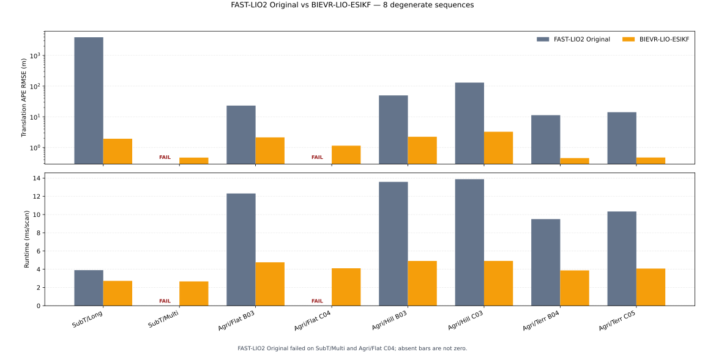
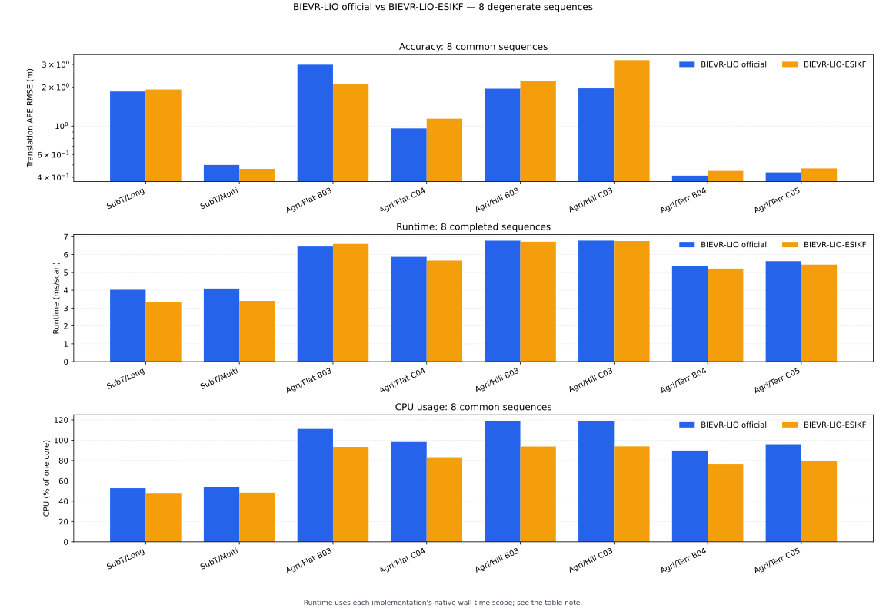
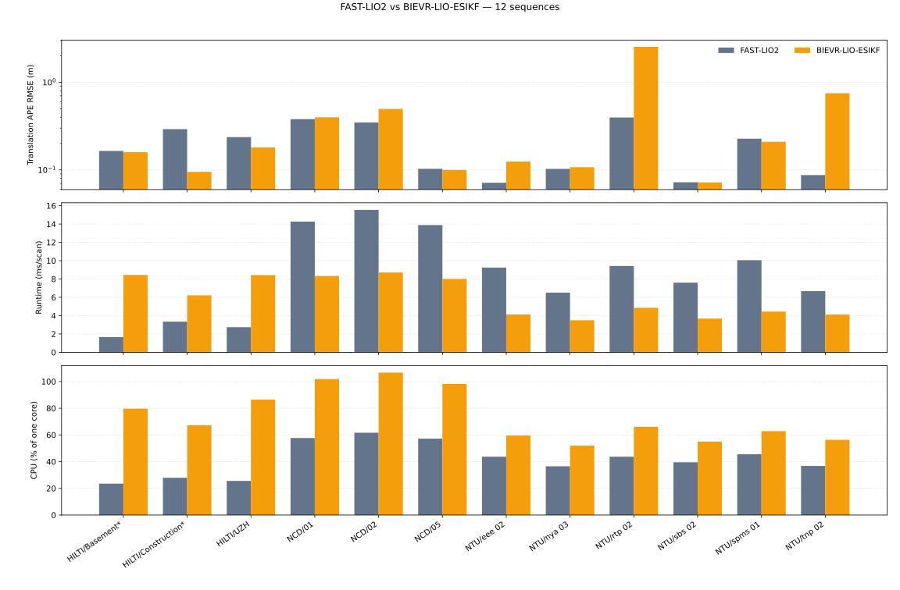
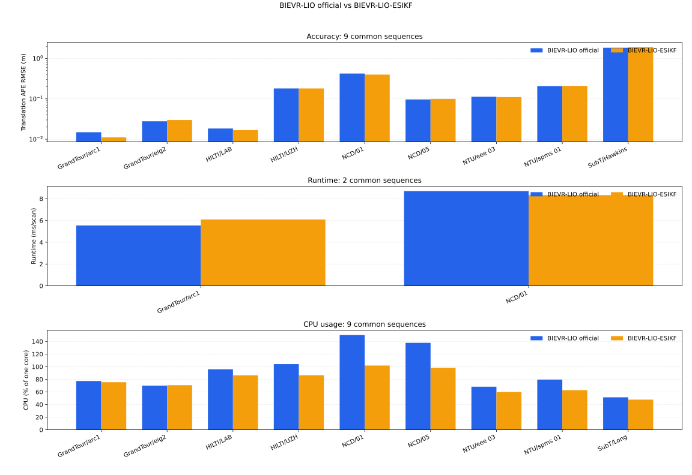

<h1 align="center"><span>BIEVR-LIO-ESIKF</span></h1>

+ This repository tightly couples the [BIEVR](https://github.com/ethz-asl/BIEVR-LIO) oriented height-image measurement model to a
  [FAST-LIO2](https://github.com/hku-mars/FAST_LIO)-family iterated error-state Kalman filter implemented with Eigen.
+ The LiDAR update uses BIEVR bump-image residuals, image-gradient Jacobians, robust Huber
  weighting, and map-informed sampling instead.
  + BIEVR voxel-wise oriented height images with bilinear residual sampling and central-difference
    image gradients.
  + BIEVR map-informed sampling: all points from high-score voxels and one representative point from
    the remaining voxels.
  + TBB-parallel preprocessing, sampling, residual construction, and map integration.
+ MTK, `MTK_BUILD_MANIFOLD`, IKFoM, ikd-Tree, and OpenMP are not used.
  + Explicit fixed-size Eigen implementation of the 17-dimensional error state, including the SO(3) perturbation and two-dimensional gravity error.
+ The proposed-method rows use the corrected right-error SO(3) covariance propagation, complete S² gravity transport, final S² covariance reset, and explicit first synchronized-scan discard.
+ Initial-IMU gravity alignment published as map_frame → odometry_frame without changing the estimator state or map.
+ A ROS-independent C++ core is shared by separate ROS1 and ROS2 wrappers.


<br>

## Dependencies

+ `C++` >= 17
+ `Eigen3`
+ `PCL`
+ `oneTBB`
+ `ROS1 Noetic` or `ROS2 Jazzy`
+ `livox_ros_driver` for ROS1 or `livox_ros_driver2` for ROS2

<br>

## How to install

### ROS2
  ```bash
  cd ~/<your_ros2_workspace>/src
  git clone <repository-url> BIEVR-LIO-ESIKF

  # ROS2
  cd ~/<your_catkin_workspace>
  source /opt/ros/jazzy/setup.bash
  colcon build --symlink-install --cmake-args -DCMAKE_BUILD_TYPE=Release
  source install/setup.bash

  # ROS1
  cd ~/<your_catkin_workspace>
  source /opt/ros/noetic/setup.bash
  catkin build bievr_lio_esikf --cmake-args -DCMAKE_BUILD_TYPE=Release
  source devel/setup.bash
  ```

<br>

## How to use

### ROS2
  ```bash
  ros2 launch bievr_lio_esikf run.launch.py \
      config_file:=mid360.yaml \
      rviz:=true
  ```

### ROS1
  ```bash
  roslaunch bievr_lio_esikf run.launch \
      config_file:=mid360.yaml \
      rviz:=true
  ```

<br>

## Measurement model
- For a world-frame point transformed into an oriented cell as $p_C = T_{CW} p_W = [u, v, z]$, the residual is
  $$
  r = z - I(u / pixel\_size, v / pixel\_size).
  $$
- With $A = e_{zᵀ} R_{CW} - [I_u, I_v] R_{CW}(0:2,:) / pixel\_size$, the Jacobian used by the iterated ESIKF is
  $$
  H_{position} = A
  H_{rotation} = A (-R_{WI} [p_I]x).
  $$
- The rotation term follows this estimator's right SO(3) perturbation convention. The residual and Jacobian are both multiplied by the square root of the Huber weight before they enter the filter.

<br>

# Performance - degenerate environments

<p align="center">
  
</p>

<p align="center">
  
</p>

### FAST-LIO2 comparison

+ FAST-LIO2 completed six of the eight sequences. It diverged on
  `SubT MRS Hawkins Multi Floor LegRobot` and `AgriLiRa4D NJFlatC04`; runtime and
  CPU measurements from those incomplete runs are omitted.

| Sequence | FAST-LIO2 APE RMSE (m) | BIEVR-LIO-ESIKF APE RMSE (m) | FAST-LIO2 runtime (ms/scan) | BIEVR-LIO-ESIKF runtime (ms/scan) | FAST-LIO2 CPU (% one core) | BIEVR-LIO-ESIKF CPU (% one core) |
| --- | ---: | ---: | ---: | ---: | ---: | ---: |
| `SubT MRS Hawkins Long Corridor RC` | 3905.4493 | **1.9227** | 4.955 | **3.345** | **28.45** | 48.07 |
| `SubT MRS Hawkins Multi Floor LegRobot` | Failed | **0.4663** | — | **3.401** | — | 48.34 |
| `AgriLiRa4D NJFlatB03` | 23.1101 | **2.1290** | 16.547 | **6.595** | **56.98** | 93.53 |
| `AgriLiRa4D NJFlatC04` | Failed | **1.1413** | — | **5.660** | — | 83.22 |
| `AgriLiRa4D NJHillB03` | 49.6606 | **2.2300** | 18.116 | **6.718** | **61.29** | 93.86 |
| `AgriLiRa4D NJHillC03` | 130.3016 | **3.2467** | 19.049 | **6.755** | **62.50** | 94.02 |
| `AgriLiRa4D NJTerrB04` | 11.2758 | **0.4498** | 11.793 | **5.212** | **47.19** | 76.10 |
| `AgriLiRa4D NJTerrC05` | 14.0998 | **0.4699** | 12.499 | **5.435** | **50.01** | 79.41 |


### BIEVR-LIO official comparison

+ Both implementations use validated one-run results from the same current campaign. Runtime
  values are method-native wall-time latency: BIEVR-LIO official measures its complete
  `processFrame` step, while BIEVR-LIO-ESIKF measures synchronized LiDAR/IMU processing through
  odometry publication through BIEVR-map update completion.

| Sequence | BIEVR-LIO official APE RMSE (m) | BIEVR-LIO-ESIKF APE RMSE (m) | BIEVR-LIO official CPU (% one core) | BIEVR-LIO-ESIKF CPU (% one core) |
| --- | ---: | ---: | ---: | ---: |
| `SubT MRS Hawkins Long Corridor RC` | **1.8551** | 1.9227 | 52.71 | 48.07 |
| `SubT MRS Hawkins Multi Floor LegRobot` | 0.5000 | **0.4663** | 53.79 | 48.34 |
| `AgriLiRa4D NJFlatB03` | 2.9902 | **2.1290** | 111.15 | 93.53 |
| `AgriLiRa4D NJFlatC04` | **0.9588** | 1.1413 | 98.26 | 83.22 |
| `AgriLiRa4D NJHillB03` | **1.9502** | 2.2300 | 119.06 | 93.86 |
| `AgriLiRa4D NJHillC03` | **1.9631** | 3.2467 | 119.09 | 94.02 |
| `AgriLiRa4D NJTerrB04` | **0.4128** | 0.4498 | 89.83 | 76.10 |
| `AgriLiRa4D NJTerrC05` | **0.4379** | 0.4699 | 95.36 | 79.41 |


| Sequence | Implementation | Samples (scans) | Mean runtime (ms/scan) | p50 runtime (ms/scan) | p95 runtime (ms/scan) | p99 runtime (ms/scan) |
| --- | --- | ---: | ---: | ---: | ---: | ---: |
| `SubT MRS Hawkins Long Corridor RC` | BIEVR-LIO official | 2776 | 4.027 | 3.951 | 4.910 | 5.466 |
| `SubT MRS Hawkins Long Corridor RC` | BIEVR-LIO-ESIKF | 2774 | 3.345 | 3.287 | 4.180 | 4.532 |
| `SubT MRS Hawkins Multi Floor LegRobot` | BIEVR-LIO official | 4137 | 4.096 | 3.909 | 5.393 | 6.164 |
| `SubT MRS Hawkins Multi Floor LegRobot` | BIEVR-LIO-ESIKF | 4136 | 3.401 | 3.264 | 4.715 | 5.353 |
| `AgriLiRa4D NJFlatB03` | BIEVR-LIO official | 1588 | 6.448 | 6.365 | 8.060 | 9.364 |
| `AgriLiRa4D NJFlatB03` | BIEVR-LIO-ESIKF | 1586 | 6.595 | 6.516 | 8.100 | 8.898 |
| `AgriLiRa4D NJFlatC04` | BIEVR-LIO official | 2787 | 5.871 | 5.747 | 7.471 | 8.738 |
| `AgriLiRa4D NJFlatC04` | BIEVR-LIO-ESIKF | 2785 | 5.660 | 5.620 | 6.746 | 7.733 |
| `AgriLiRa4D NJHillB03` | BIEVR-LIO official | 1675 | 6.779 | 6.695 | 8.694 | 10.141 |
| `AgriLiRa4D NJHillB03` | BIEVR-LIO-ESIKF | 1673 | 6.718 | 6.623 | 8.177 | 9.129 |
| `AgriLiRa4D NJHillC03` | BIEVR-LIO official | 2374 | 6.781 | 6.667 | 8.936 | 10.590 |
| `AgriLiRa4D NJHillC03` | BIEVR-LIO-ESIKF | 2371 | 6.755 | 6.707 | 8.338 | 9.218 |
| `AgriLiRa4D NJTerrB04` | BIEVR-LIO official | 957 | 5.366 | 5.174 | 7.439 | 8.603 |
| `AgriLiRa4D NJTerrB04` | BIEVR-LIO-ESIKF | 955 | 5.212 | 4.829 | 7.358 | 8.241 |
| `AgriLiRa4D NJTerrC05` | BIEVR-LIO official | 1452 | 5.626 | 5.331 | 8.202 | 9.459 |
| `AgriLiRa4D NJTerrC05` | BIEVR-LIO-ESIKF | 1450 | 5.435 | 4.936 | 7.825 | 8.916 |

<br>

# Performance - non-degenerate environments

<p align="center">
  
</p>

<p align="center">
  
</p>

### FAST-LIO2 comparison

| Sequence | FAST-LIO2 APE RMSE (m) | BIEVR-LIO-ESIKF APE RMSE (m) | FAST-LIO2 runtime (ms/scan) | BIEVR-LIO-ESIKF runtime (ms/scan) | FAST-LIO2 CPU (% one core) | BIEVR-LIO-ESIKF CPU (% one core) |
| --- | ---: | ---: | ---: | ---: | ---: | ---: |
| `HILTI Basement_1 (Mid70 / Ouster)` | 0.1646 | **0.1592** | **1.661** | 8.445 | **23.49** | 79.64 |
| `HILTI Construction_Site_2 (Mid70 / Ouster)` | 0.2922 | **0.0950** | **3.348** | 6.214 | **27.89** | 67.25 |
| `HILTI uzh_tracking_area_run2 (Mid70 / Ouster)` | 0.2368 | **0.1808** | **2.742** | 8.425 | **25.58** | 86.43 |
| `Newer College 01_short` | **0.3800** | 0.3982 | 14.264 | **8.329** | **57.68** | 101.84 |
| `Newer College 02_long` | **0.3485** | 0.4970 | 15.543 | **8.705** | **61.64** | 106.64 |
| `Newer College 05_quad` | 0.1030 | **0.0998** | 13.889 | **8.008** | **57.19** | 98.15 |
| `NTU VIRAL eee_02` | **0.0713** | 0.1245 | 9.248 | **4.122** | **43.69** | 59.53 |
| `NTU VIRAL nya_03` | **0.1029** | 0.1071 | 6.508 | **3.495** | **36.50** | 51.96 |
| `NTU VIRAL rtp_02` | **0.3966** | 2.5417 | 9.424 | **4.856** | **43.70** | 66.05 |
| `NTU VIRAL sbs_02` | 0.0723 | **0.0720** | 7.598 | **3.680** | **39.51** | 54.97 |
| `NTU VIRAL spms_01` | 0.2271 | **0.2094** | 10.051 | **4.445** | **45.53** | 62.81 |
| `NTU VIRAL tnp_02` | **0.0873** | 0.7506 | 6.673 | **4.120** | **36.75** | 56.29 |


### BIEVR-LIO official comparison

+ Official BIEVR-LIO values are the two-run means from its reference campaign. The
  BIEVR-LIO-ESIKF column uses the current corrected one-run results.

| Sequence | BIEVR-LIO official APE RMSE (m) | BIEVR-LIO-ESIKF APE RMSE (m) | BIEVR-LIO official CPU (% one core) | BIEVR-LIO-ESIKF CPU (% one core) |
| --- | ---: | ---: | ---: | ---: |
| `GrandTour arc1 gt` | 0.0149 | **0.0111** | 77.32 | 75.41 |
| `GrandTour eig2 gt` | **0.0278** | 0.0299 | 70.02 | 70.64 |
| `HILTI LAB Survey 2 (Ouster)` | 0.0184 | **0.0168** | 95.86 | 86.32 |
| `HILTI UZH tracking area run 2 (Ouster)` | 0.1809 | **0.1808** | 104.12 | 86.43 |
| `Newer College 01 short experiment` | 0.4235 | **0.3982** | 150.11 | 101.84 |
| `Newer College 05 quad with dynamics` | **0.0963** | 0.0998 | 137.76 | 98.15 |
| `NTU VIRAL eee 03` | 0.1126 | **0.1106** | 68.25 | 59.79 |
| `NTU VIRAL spms 01` | **0.2069** | 0.2094 | 79.53 | 62.81 |
| `SubT MRS Hawkins Long Corridor RC` | **1.8381** | 1.9247 | 51.43 | 47.75 |


| Sequence | Implementation | Samples (scans) | Mean runtime (ms/scan) | p50 runtime (ms/scan) | p95 runtime (ms/scan) | p99 runtime (ms/scan) |
| --- | --- | ---: | ---: | ---: | ---: | ---: |
| `GrandTour arc1 gt` | BIEVR-LIO official | 4332 | 5.541 | 5.572 | 6.952 | 7.630 |
| `GrandTour arc1 gt` | BIEVR-LIO-ESIKF | 4329 | 6.092 | 6.168 | 7.666 | 9.009 |
| `Newer College 01 short experiment` | BIEVR-LIO official | 15301 | 8.694 | 8.503 | 11.914 | 13.700 |
| `Newer College 01 short experiment` | BIEVR-LIO-ESIKF | 15299 | 8.329 | 8.260 | 10.589 | 11.744 |

<br>

## LICENSE

+ The oriented height-image map, residual/Jacobian, and map-informed sampling follow [BIEVR-LIO](https://github.com/ethz-asl/BIEVR-LIO). BIEVR-derived portions remain subject to their compatible upstream BSD 3-Clause terms
+ The iterated ESIKF and LiDAR-inertial processing lineage follows [FAST-LIO2](https://github.com/hku-mars/FAST_LIO). The repository as a whole is therefore distributed under GNU GPL version 2.
+ The BIEVR-derived implementation preserves the upstream BSD 3-Clause notice directly in
  `bievr_lio_esikf/include/bievr_voxel_map.hpp`.
+ `ankerl::unordered_dense` retains its upstream MIT notice in the vendored source headers.
